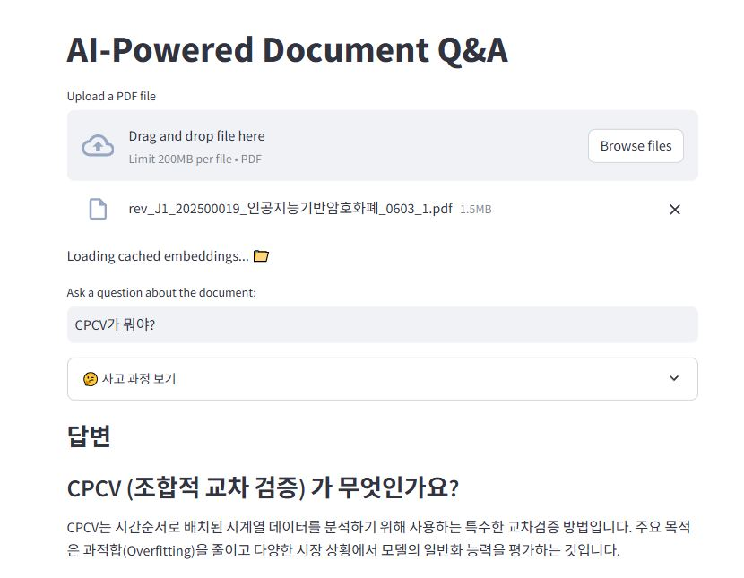

# AI-Powered Document Q&A


이 프로젝트는 PDF 문서에 대한 질의응답을 수행하는 AI 기반 챗봇입니다. LangChain, Ollama, FAISS, BM25, Cross-Encoder를 활용하여 하이브리드 검색 방식을 구현했습니다.

## 주요 기능

- PDF 문서 업로드 및 처리
- 하이브리드 검색 (FAISS + BM25 + Cross-Encoder)
- 캐싱을 통한 빠른 문서 처리
- 한글 기반 질의응답

## 설치 방법

1. 저장소 클론
```bash
git clone https://github.com/your-username/my-pdf-chatbot.git
cd my-pdf-chatbot
```

2. 가상환경 생성 및 활성화
```bash
python -m venv venv
# Windows
venv\Scripts\activate
# Linux/Mac
source venv/bin/activate
```

3. 의존성 설치
```bash
pip install -r requirements.txt
```

4. Ollama 설치 및 모델 다운로드
- [Ollama 설치 가이드](https://ollama.ai/download)를 따라 Ollama를 설치합니다.
- 다음 명령어로 필요한 모델을 다운로드합니다:
```bash
ollama pull nomic-embed-text
ollama pull deepseek-r1:8b
```

## 실행 방법

```bash
streamlit run app.py
```

## 데모




## 사용 방법

1. 웹 브라우저에서 `http://localhost:8501` 접속
2. PDF 파일 업로드
3. 문서에 대한 질문 입력
4. AI의 답변 확인

## 기술 스택

- LangChain
- Ollama
- FAISS
- BM25
- Cross-Encoder
- Streamlit

## 라이선스

MIT License

## Requirements

The following libraries are required for this project:

* `faiss-cpu` >= 1.10.0
* `langchain-community` >= 0.3.18
* `langchain-ollama` >= 0.0.1
* `langchain` >= 0.3.19
* `pypdf` >= 5.3.0
* `sentence-transformers` >= 3.4.1
* `streamlit` >= 1.42.2
* `rank-bm25` >= 0.2.2
* `ollama` (local installation required)

You can install the necessary dependencies using pip:

```bash
pip install -r requirements.txt
```

## Prerequisites

1. Install Ollama from [https://ollama.ai](https://ollama.ai)
2. Pull required models:
```bash
ollama pull nomic-embed-text
ollama pull deepseek-r1:8b
```

## Overview

The application runs as follows:

* User can upload a PDF document
* Application processes the document by splitting it into chunks
* Creates a hybrid retrieval system combining:
  - FAISS vector database using Ollama embeddings
  - BM25 for keyword-based search
  - Cross-Encoder for re-ranking results
* Uses the Ollama LLM to answer questions related to the document

## Features

1. **Hybrid Retrieval System**
   - Combines semantic search (FAISS) with keyword search (BM25)
   - Uses Cross-Encoder for re-ranking results
   - Provides more accurate and relevant document chunks

2. **Local LLM Processing**
   - Uses Ollama for local model inference
   - No API keys required
   - Supports both embedding and text generation

3. **Caching System**
   - Implements document embedding caching
   - Reduces processing time for previously analyzed documents

4. **Korean Language Support**
   - Optimized for Korean language processing
   - Provides detailed reasoning in Korean

## How to Run

1. Install dependencies:
```bash
pip install -r requirements.txt
```

2. Start the Streamlit app:
```bash
streamlit run app.py
```

3. Open your browser and navigate to the provided local URL (usually http://localhost:8501)

## Project Structure

```
.
├── app.py              # Main application file
├── requirements.txt    # Project dependencies
├── scripts/           # Utility scripts
│   └── document_loader.py
└── embedding_cache/   # Cache directory for embeddings
```

## Author
[doyun317](https://github.com/doyun317)

